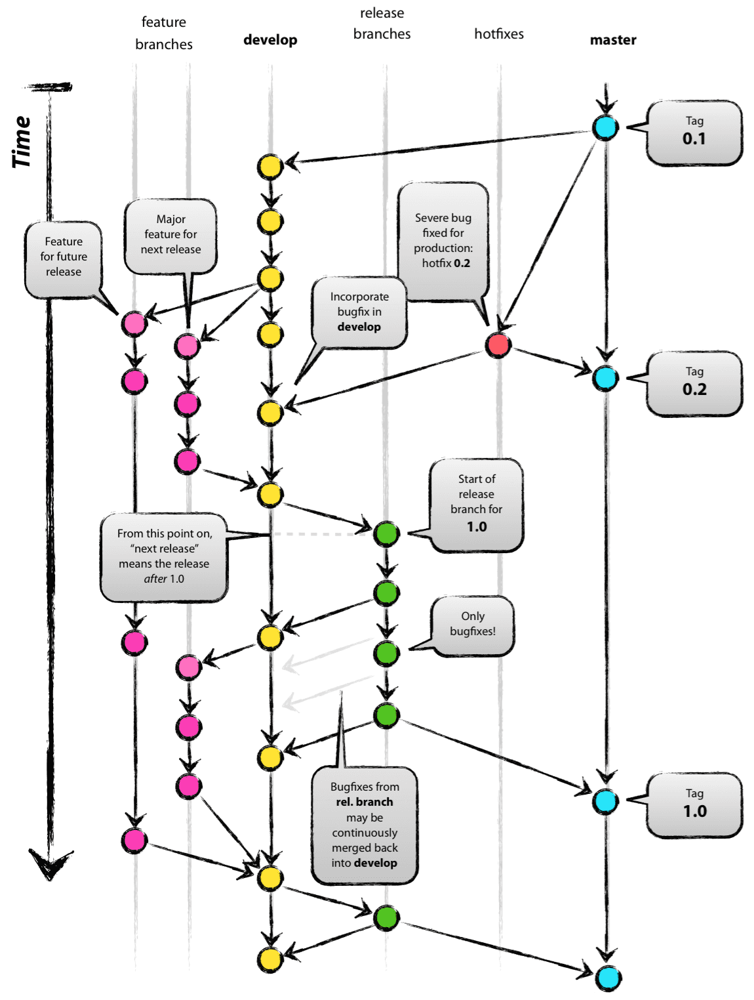
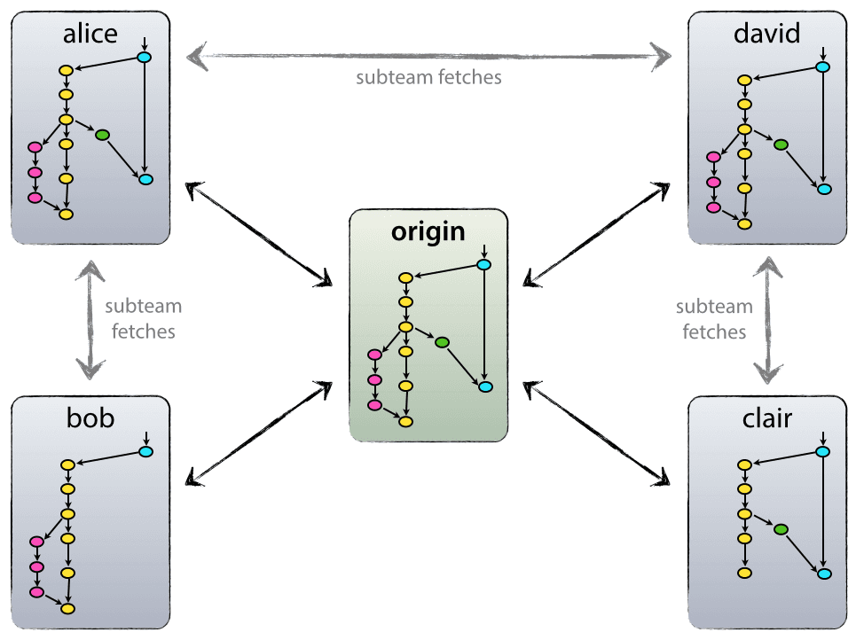
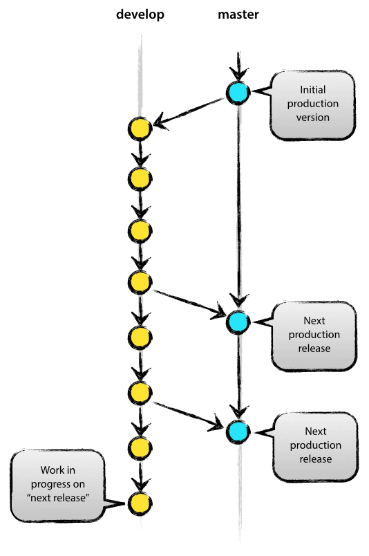
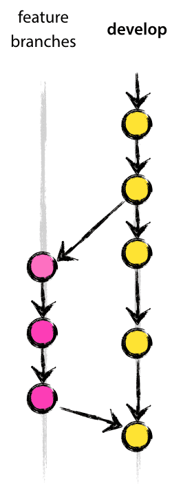
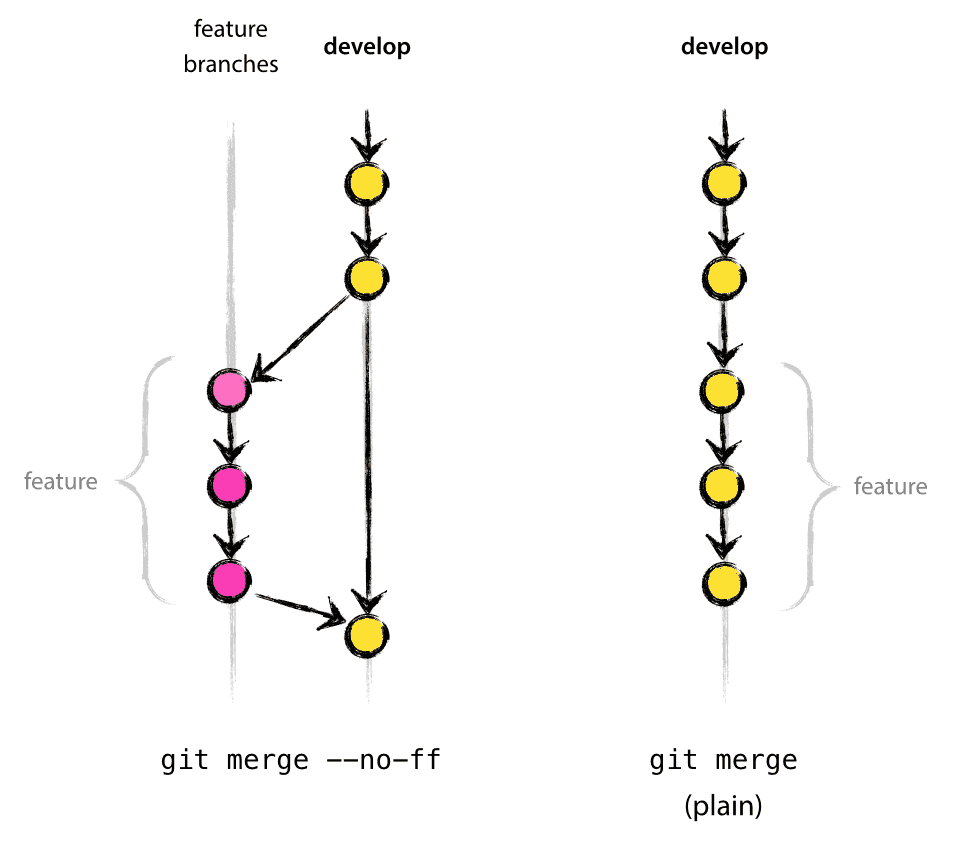
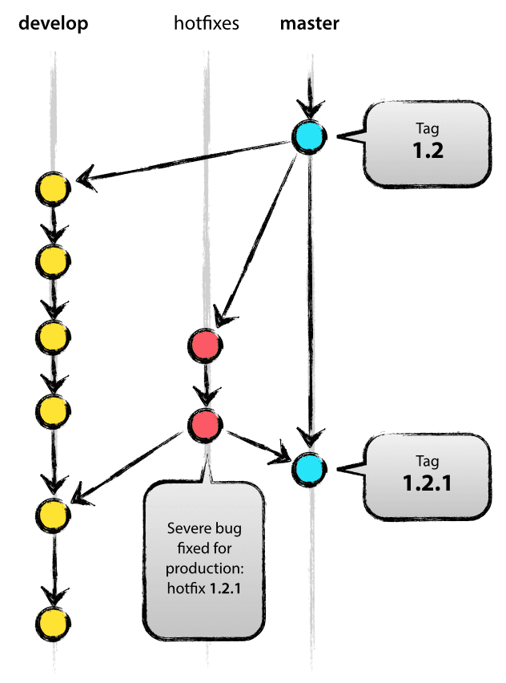

Guide for Contributing to ROOT-Sim
==================================

Thanks for your interest in ROOT-Sim! ROOT-Sim stems from an inter-university research effort, and has seen many people proposing patches, implementing bleeding new subsystems, and help at polishing the code or rewriting previously-existing modules.

This guide is intended to give you some advices on how to contribute to the project, ensuring that your patches are consistent with the code base and easy to maintain by people which will come after you.

## TL;DR

If you want to contribute to ROOT-Sim, these are the essential steps:

* Fork a new branch named `hotfix-*` from `master` if you want to provide a bugfix for a bug in production, or named _whatever_ from `develop` if you want to provide a new feature.
* Implement your changes, trying to adhere to coding styles as much as possible. Use `doxygen` syntax to document _functions_, _variables_, _structures_, _enums_, _global variables_, everything!
* Update `ChangeLog` in the `[Unreleased]` section.
* Update the wiki (if necessary).
* Update manpages (if necessary).
* Clone `gh-pages` and create a post describing your new feature (it's made using [jekyll](https://jekyllrb.com/])).
* Test everything using the script `./scripts/tests.sh` (Travis-CI does that for you every time that you commit on your branch).
* Create a pull request to `develop` or `master`. A `hotfix-*` branch should be merged in both.

Thanks a lot for your help!


Branching Model
---------------

We use a strict branching model to drive the ROOT-Sim development, which is here described. This model ensures that the mergeability likelihood is high, and that the patches that you produce can be integrated seamlessy and quickly. The adopted branching model can be summarized as follows:



The development model adopted by ROOT-Sim is essentially no more than a set of procedures that every team member has to follow in order to come to a managed software development process.

### Decentralised but centralised

The repository setup that we use and that works well with this branching model, is that with a central “truth” repo. Note that this repo is only considered to be the central one (since Git is a DVCS, there is no such thing as a central repo at a technical level). We will refer to this repo as origin, since this name is familiar to all Git users.



Each developer pulls and pushes to origin. But besides the centralized push-pull relationships, each developer may also pull changes from other peers to form sub teams. For example, this might be useful to work together with two or more developers on a big new feature, before pushing the work in progress to origin prematurely. In the figure above, there are subteams of Alice and Bob, Alice and David, and Clair and David.

Technically, this means nothing more than that Alice has defined a Git remote, named bob, pointing to Bob’s repository, and vice versa.

### The main branches



The central repo holds two main branches with an infinite lifetime:

* `master`
* `develop`

The `master` branch at origin should be familiar to every Git user. Parallel to the `master` branch, another branch exists called `develop`.

We consider `origin/master` to be the main branch where the source code of `HEAD` always reflects a *production-ready* state.

We consider `origin/develop` to be the main branch where the source code of `HEAD` always reflects a state with the latest delivered development changes for the next release. Some would call this the "*integration branch*".

When the source code in the `develop` branch reaches a stable point and is ready to be released, all of the changes should be merged back into `master` somehow and then tagged with a release number. How this is done in detail will be discussed further on.

Therefore, each time when changes are merged back into `master`, this is a new production release *by definition*. This must be enforced strictly: if there is some issue which is still known to be in the `origin/develop` for some reason, then `origin/develop` should not be merged into `origin/master`.

`origin/master` is a *protected branch*: no one can directly push into it. This branch is used only by relying on *pull requests*, and the repository rules enforce that all automatic integration checks must pass in order to merge, and at least two independent code reviews are required for a pull request to be merged. This should reduce the chances that a broken release is delivered.

### Supporting Branches

Next to the main branches `master` and `develop`, our development model uses a variety of supporting branches to aid parallel development between team members, ease tracking of features, prepare for production releases and to assist in quickly fixing live production problems. Unlike the main branches, these branches always have a limited life time, since they will be removed eventually.

The different types of branches we may use are:

* Feature branches
* Hotfix branches
* Release branches

Each of these branches have a specific purpose and are bound to strict rules as to which branches may be their originating branch and which branches must be their merge targets. We will walk through them shortly.

By no means are these branches "special" from a technical perspective. The branch types are categorized by how we use them. They are of course plain old Git branches.

In general, if you want to contribute by delevoping a *new feature*, you should use a **feature branch**. If you have spotted a bug and have a patch for it, you should rely on a **hotfix branch**.

The semantics behind these branches are described below.

### Feature Branches



|                  Rule | Description                                                     |
|----------------------:|-----------------------------------------------------------------|
|      May branch from: | `develop`                                                       |
| Must merge back into: | `develop`                                                       |
|    Naming convention: | anything except `master`, `develop`, `release-*`, or `hotfix-*` |


Feature branches (or sometimes called topic branches) are used to develop new features for the upcoming or a distant future release. When starting development of a feature, the target release in which this feature will be incorporated may well be unknown at that point (an issue marked as a development note might result in such a branch). The essence of a feature branch is that it exists as long as the feature is in development, but will eventually be merged back into develop (to definitely add the new feature to the upcoming release) or discarded (in case of a disappointing experiment).

Feature branches typically exist in developer repos only, not in `origin`, although we do not necessarily strictly enforce this.

#### Creating a feature branch

When starting work on a new feature, branch off from the `develop` branch.

```
$ git checkout -b myfeature develop
Switched to a new branch "myfeature"
```

#### Incorporating a finished feature on `develop`

It is a good practice to issue a **Pull Request** to incorporate a feature branch into develop, and ask at least for one code review.

Finished features may be anyhow merged into the develop branch definitely add them to the upcoming release, provided that extensive tests have been carried:

```
$ git checkout develop
Switched to branch 'develop'

$ git merge --no-ff myfeature
Updating ea1b82a..05e9557
(Summary of changes)

$ git branch -d myfeature
Deleted branch myfeature (was 05e9557).

$ git push origin develop
```

In case you want to delete the remote branch, you can additionally run:

```
git push origin --delete myfeature
```

The `--no-ff` flag causes the merge to always create a new commit object, even if the merge could be performed with a fast-forward. This avoids losing information about the historical existence of a feature branch and groups together all commits that together added the feature. Compare:



In the latter case, it is impossible to see from Git history which of the commit objects together have implemented a feature (you would have to manually read all the log messages). Reverting a whole feature (i.e. a group of commits), is a true headache in the latter situation, whereas it is easily done if the `--no-ff` flag was used.
Yes, it will create a few more (empty) commit objects, but the gain is much bigger that that cost.

Merging into `develop` is sometimes referred to as "merge window". Once a new release branch is created (see below), new features are automatically directed towards the next release.

Once a feature branch is closed, the contributor is required to create a short notice on the project website, Please, see section *Short Notes on the Project Website* below.


### Release Branches

|                  Rule | Description            |
|----------------------:|------------------------|
|      May branch from: | `develop`              |
| Must merge back into: | `develop` and `master` |
|    Naming convention: | `release-*`            |


Release branches support preparation of a new production release. They allow for last-minute dotting of i's and crossing t's. Furthermore, they allow for minor bug fixes and preparing meta-data for a release (version number, build dates, etc.). By doing all of this work on a release branch, the `develop` branch is cleared to receive features for the next big release.

The key moment to branch off a new release branch from `develop` is when `develop` (almost) reflects the desired state of the new release. At least all features that are targeted for the release-to-be-built must be merged in to `develop` at this point in time. All features targeted at future releases may not: they must wait until after the release branch is branched off.

It is exactly at the start of a release branch that the upcoming release gets assigned a version number, not any earlier. Up until that moment, the `develop` branch reflected changes for the "next release", but it is unclear whether that "next release" will eventually become 0.3 or 1.0, until the release branch is started. That decision is made on the start of the release branch and is carried out by the project's rules on version number bumping.

#### Creating a release branch 

Release branches are created from the `develop` branch. For example, say version 1.1.5 is the current production release and we have a big release coming up. The state of develop is ready for the "next release". So we branch off and give the release branch a name reflecting the new version number:

```
$ git checkout -b release-1.2.0 develop
Switched to a new branch "release-1.2.0"

$ ./bump-version.sh
Files modified successfully, version bumped to 1.2.0

$ git commit -s -a -m "Bumped version number to 1.2.0"
[release-1.2.0 74d9424] Bumped version number to 1.2.0
1 files changed, 1 insertions(+), 1 deletions(-)
```

After creating a new branch and switching to it, we bump the version number. Here, `bump-version.sh` is a commodity shell script, included in the repository, that changes the relevant information in the source tree to reflect the new version. This shell script reads the name of the current branch and automatically increases the version number depending on the kind of branch (hence, the importance of branch names). The only exception is when we want to update the major number, which is a decision which cannot be taken automatically (see versioning below). To bump the major version number, you can run the following command:

```
$ ./bump-version.sh major
```

This newly-created branch may exist there for a while, until the release may be rolled out definitely. During that time, bug fixes may be applied in this branch (rather than on the `develop` branch). Adding large new features here is **strictly prohibited**. They must be merged into `develop`, and therefore, wait for the next big release.

#### Finishing a release branch 

When the state of the release branch is ready to become a real release, some actions need to be carried out.

First, the release branch must be merged into `master`. This action can be only done by issuing a Pull Request, and asking for two different code reviews which must positively pass. Also, all automatic tests must pass.

Once the Pull Request is merged (again creating a no-fast-foward commit), the changes made on the release branch need to be merged back into `develop`, so that future releases also contain these bug fixes.

We then have to create a tag to identify the new release in `master`. By definition, all tags must be signed. This should be done by using git’s integration with PGP, so a key to identify the signer must be publicly available. At least, for easiness of retrieval, the public key of the person creating the tag should be published here:

* http://pgp.mit.edu/[http://pgp.mit.edu/](http://pgp.mit.edu/) 
* [http://keyserver.pgp.com/ ](http://keyserver.pgp.com/) 

To set up git for using your private key to sign tags:

```
$ git config --global user.signingkey HASH
```

This allows to use `-s` as a shortcut to select the key for signing. If you don't want for some reason to globally set your key for signing, in the tag creation command you must replace `-s` with `-u <key>`.

The git steps to create the release from the `master branch` after that the Pull Request have been merged are:

```
$ git checkout master
Switched to branch 'master'

$ git pull
(Summary of changes)

$ git tag -s -a 1.2.0
```

Note that here you must manually specify a version number as the tag name, coherent with the version number which you are releasing.

To publish the tag on origin, the following command can be used:

```
$ git push --follow-tags
```

It pushes only "sane" tags, namely tags that are both:

* Annotated
* Reachable (an ancestor) from the pushed commits

This is sane because only annotated tags should be pushed on the remote, keeping lightweight tags for local development only, and doesnt push tags on unrelated branches. `git push --tags` should be avoided at all because it pushes all tags, not only "sane" ones.

The release is now done, and tagged for future reference.
To keep the changes made in the release branch, we need to merge those back into `develop`, though. In git:

```
$ git checkout develop
Switched to branch 'develop'

$ git merge --no-ff release-1.2.0
Merge made by recursive.
(Summary of changes)
```

This step may well lead to a merge conflict (probably even, since we have changed the version number). If so, fix it and commit.

Now we are really done and the release branch may be removed, since we don’t need it anymore:

```
$ git branch -d release-1.2
Deleted branch release-1.2 (was ff452fe).
```

### Hotfix Branches



|                  Rule | Description            |
|----------------------:|------------------------|
|      May branch from: | `master`               |
| Must merge back into: | `develop` and `master` |
|    Naming convention: | `hotfix-*`             |


Hotfix branches are very much like release branches in that they are also meant to prepare for a new production release, albeit unplanned. They arise from the necessity to act immediately upon an undesired state of a live production version. When a critical bug in a production version must be resolved immediately, a hotfix branch may be branched off from the corresponding tag on the `master` branch that marks the production version.

The essence is that work of team members (on the `develop` branch) can continue, while another person is preparing a quick production fix.

#### Creating the hotfix branch 

Hotfix branches are created from the `master` branch. For example, say version 1.2.1 is the current production release running live and causing troubles due to a severe bug. But changes on `develop` are yet unstable. We may then branch off a hotfix branch and start fixing the problem:

```
$ git checkout -b hotfix-1.2.1 master
Switched to a new branch "hotfix-1.2.1"

$ ./bump-version.sh
Files modified successfully, version bumped to 1.2.1.

$ git commit -s -a -m "Bumped version number to 1.2.1"
[hotfix-1.2.1 41e61bb] Bumped version number to 1.2.1
1 files changed, 1 insertions(+), 1 deletions(-)
```

Don't forget to bump the version number after branching off! Again, the `bump-version.sh` script will automatically determine the new version number starting from the branch name.

Then, fix the bug and commit the fix in one or more separate commits.

```
$ git commit
[hotfix-1.2.1-2 abbe5d6] Fixed severe production problem
5 files changed, 32 insertions(+), 17 deletions(-)
```

#### Finishing a hotfix branch
When finished, the bugfix needs to be merged back into `master`, but also needs to be merged back into `develop`, in order to safeguard that the bugfix is included in the next release as well. This is completely similar to how release branches are finished.

The one exception to the rule here is that, when a release branch currently exists, the hotfix changes need to be merged into that release branch, instead of `develop`. 

Back-merging the bugfix into the release branch will eventually result in the bugfix being merged into `develop` too, when the release branch is finished. 

(If work in develop immediately requires this bugfix and cannot wait for the release branch to be finished, you may safely merge the bugfix into `develop` now already as well.)

Finally, remove the temporary branch:

```
$ git branch -d hotfix-1.2.1
Deleted branch hotfix-1.2.1 (was abbe5d6).
```


Commits and Commit Messages
---------------------------

A commit should be a self-contained update to the code tree. Despite bug fixes that could be introduced later in the development, a commit should be never considered as "I’m saving my work now, I’ll continue later", especially if the commit is pushed to a remote repository.

On the other hand, a commit should not contain multiple changes to the code base. If, during development, I have to change something in two different modules, and the changes are unrelated, then the changes should be placed in two different commits. That is: make separate commits for logically separate changes.

Making good commits is a form of art. A good way to decide whether a commit is self-contained, developers should answer themselves the question: "will I be able to cherry pick this commit in the future, shall I need it?". If the answer is yes, then most likely it is a good commit.

Commit messages should be meaningful. A one-line commit message like "I’m developing foo" will not allow other developers to understand what that commit is for. A minimal commit message would be of the format:

```
  Short log

  (Optional pointers to external resources, such as defect tracking)

  The intent of your change.

  (Optional, if it's not clear from above) how your change resolves the
  issues in the first part.

  Tag line(s) at the end.	
```

This is an example of a good commit message:

```
  foobar: Adjusted the foo setting in bar

  When using foobar on systems with less than a gigabyte of RAM common
  usage patterns often result in an Out-of-memory condition causing
  slowdowns and unexpected application termination.
 
  Low-memory systems should continue to function without running into
  memory-starvation conditions with minimal cost to systems with more
  available memory.  High-memory systems will be less able to use the
  full extent of the system, a dynamically tunable option may be best,
  long-term.
  
  The foo setting in bar was decreased from X to X-50% in order to
  ensure we don't exhaust all system memory with foobar threads.
  
  Signed-off-by: Joe Developer <joe.developer@example.com>
```

Several things should be noted here. The minimal commit message is good for new code development and simple changes. An empty line must always come after it, otherwise post processing software might not be able to distinguish it from the rest of the commit text.

The single short log message indicates what needed to be changed. It should begin with an indicator as to the primary item changed by this work, followed by a short summary of the change. In the above case we're indicating that we've changed the "foobar" item, by "adjusting the foo setting in bar".

The single short log message is analogous to the git "commit summary". While no maximum line length is specified by this policy, it is suggested that it remains under 50 characters wherever possible. Think of it as the subject of an email: you should never write too much text in it, otherwise receivers will not understand easily what the email is about.

Optionally, you may include pointers to defects this change corrects. Unless the defect format is specified by the component you are modifying, it is suggested that you use a full URL to specify the reference to the defect information. Generally, these pointers will precede any long description, but as an optional item it may be after the long description. This could be a good way, for example, to refer to open issues in a bug tracker.
You must then have a full description of the change. Specifying the intent of your change and if necessary how the change resolves the issue.

Finally, one or more tag lines should exist. Each developer responsible for working on the patch is responsible for adding a `Signed-off-by:` tag line. This tag line should be added by people writing the patch, and additional tag lines should be added by people, for example, merging the patch into different branches. This allows to easily track the updates to the code base, and determine who did what.

It is not acceptable to have an empty or non-existent header, or just a single line message. The summary and description is required for all changes. 

The commit messages should be manually indented. Usually, each line of the message, should not be longer than 78 characters. Note that in order to do this easily, is always better to avoid using the `-m` switch when committing: in fact, simply issuing:

```
$ git commit
```

will fire up the text editor specified in the `EDITOR` environment variable (you can set it to your preferred editor), so that you can freely write your commit message respecting the adopted layout. Note that if you set your favorite editor to vim, you can add the following lines to ~/.vimrc:

```
filetype plugin indent on
au FileType gitcommit set tw=72
```

which automatically wraps the text to the specified 72 characters for git commit messages. To check whether vim is correctly identifying the commit message as gitcommit, the following command can be used within vi:

```
:set filetype?
```

or to save a few keystrokes:

```
:se ft?
```


If, for any reason, you have pushed commits with non-meaningful descriptions (due to hurry, pressure, `git fire`, etc.), these should never end up in the `master` branch. Here, interactively rebasing you local branch (and issuing a force push if possible) is a good practice.


Versioning
----------

ROOT-Sim follows a small variation of ([semantic versioning](http://semver.org/). Basically, each version number is structured in this way:

```
MAJOR.MINOR.HOTFIX
```

The `HOTFIX` part is incremented whenever a hotfix branch is merged into `master`. In this way, users know that the difference between 1.2.0 and 1.2.1 is not related to new features being introduced in the software.

The `MINOR` part is incremented whenever a new functionality is introduced into the software. This means that the current version still offers all the features that were present in the previous versions, plus something new. In this way, the user knows that when switching from version 1.2.x to 1.3.0, the software will still behave as in the previous release.

The `MAJOR` part is incremented in two different cases:

* Some incompatibility is introduced. This incompatibility will be described in the release notes for the version. In this way, the user will know that transitioning from 1.x.x to 2.0.0 will require some intervention. This includes, for example, if version 2.0.0 still offers the same functionalities of 1.x.x, yet the default configuration is different.

* A large batch of updates to the software have been introduced. In any case, an increment in the `MAJOR` number is tolerated whenever we want to emphasize that, even if still behaving as in the previous release, the codebase has been significantly enlarged with new functionalities.


Documentation
-------------

ROOT-Sim documentation is organised into three different parts, some of which are updated automatically, others need manual intervention.

### Change Log

The `ChangeLog` file in the master folder is an important living document which should be updated any time that a new feature is added, or something is changed in the code. Therefore, before committing to any branch, take some time to understand whether you should put some note on what you are doing in that file. This simplifies a lot the release of a new version, as this reduces the time required to navigate back the git log.

Changes in the `ChangeLog` file should go in the `[Unreleased]` section which is at the top of the file. This also helps users at understanding what changes are expected to come in the next releases.

Once a new release is being rolled out, the `[Unreleased]` section should be renamed into the release version, and a new empty `[Unreleased]` section should be created. This new section should carry all the required subsections (`Added`, `Changed`, `Deprecated`, `Removed`, `Fixed`) which are later removed upon a release, if they are empty.

### Doxygen

Please use Doxygen to comment your code. Any time that a new version is merged into `master`, the continuous integration system will rebuild the documentation and publish it on the project website, to be sure that everything is always up to date.

For blocks, we use the following syntax:
```c
/**
 * @file buddy.h
 * @brief Buddy-system memory allocator
 */
```

 On the other hand, for one-line comments, we use the following syntax:

```c
struct tw_lptype {
	init_f init; ///< LP setup routine
	pre_run_f pre_run; ///< Second stage LP initialization
};
```

Comments using `///` can also be used, but they must be placed before the definition which the comment is referring to, in order for Doxygen to correctly use it.

### Wiki

Wiki is a quite important part of the project. Please, take some time when contributing to mark changes in the wiki as well! There are some pages of the wiki (those related to download, usage, and system libraries) which are automatically reflected in the website by the continuous integration system, so do keep them updated.

### Manpages

manpages should document anything that is exposed to application-model developers. They are located in the `man/` subforlder of the project.

Anytime that you add or modify something that is exposed, please take time to update manpages. This significantly helps at keeping the quality of the project high.

Short Notes on the Project Website
----------------------------------

ROOT-Sim webpage is implemented using Jekyll, and hosted on github pages. Any time that a new function or subsystem is implemented and merged into `develop`, we require the develpers to create a short notice as a blog post in the `_posts` subfolder in the `gh-pages` branch.

The continuous integration script relying on travis automatically rebuilds the website when a branch is merged into `master`. This allows to always know what a new release will carry. Also, this helps maintainers at preparing release notes when a new version is released.

Please note that `gh-pages` is a protected branches, therefore the update should be carried out using a Pull request, to allow maintainers to keep track of the changes.

Coding Style Guidelines
-----------------------

We want to keep the code base as uniform as possible. Here we describe the coding guidelines which should be used when preparing a patch to ROOT-Sim.

Please, enforce it as much as possible, configuring your favourite editor to help you at this job.

### Naming Convention

ROOT-Sim uses a mixed convention. In particular:

* CamelCase names are *only* used for functions which are exposed to simulation model developers;
* Internal functions use a `_` to separate words.

This allows to immediately see the purpose of a function when reading the code: `RandomNumber` is something that is externally exposed, while `random_numer` is something used internally.

### Indentation and braces

We have decided to use a tab (`\t`) as a tab for the project. A tab is just a tab: *please*, do not use whitespaces (be they 8, 4, ...) instead of tab when indenting.

Anything inside a block of code, delimited by `{` and `}`, should be indented on one level more. This entails, e.g., data structures, enums, for example:

```
struct my_structure {
    int field;
    ...
};
```

Braces always go on the same line of the definition,
except for function definition. The opening bracket of a function must be placed on a separate line, as in:

```
void foo(void)
{
	...
}
```


However, if the leading `if`/`while`/`for` expression spans more than one line, then the brace should be on a line by itself, in order to make clearer which lines are part of the expression and which lines are part of the block. An example:

```
 if ( grarzbo(mof, glorble(gronk), fofo, obo,
              fronk, bleeb)  &&
      grarzbo(fom, 42, 0, 0, 0, 0) )
 {
    ...
 } else {
    ...
 }
```

Case statements should be fully indented. cases must live on a level on their own, for examle:

```
switch(var) {
	case 0:
		...
		break;
	default:
		...
}
```

Note that we do not require case statements to always have blocks attached. Use block in them only when they are required (e.g., when there is a need to declare a variable within a case). The `break` keyword should be treated as a regular instruction, and therefore indented as part of the case block.

Labels used as `goto` targets are an exception to indentation. In case a label is used, we require the last tab in the indention to be represented as 4 spaces (however, do not use goto unless you can articulate clearly and defensibly why you ought not to use it).

`goto`s are regular instructions, so they whould be fully indented as well:

```
 void fooo(int a) {
	...
	goto out;
	...
    out:
	...
 }
```

### Vertical Spacing

Don't collapse statements to single lines.

* Multiple statements on a single line make stepping and setting breakpoints difficult when debugging.
* We're no longer working from teletypes

Inserting blank before/after a chunk of code can be useful for indicating a conceptual grouping.

### Spacing

* Space after commas, never before
* Space before `{` declaring a block of code
* Space around comparing signs, binary logical/arithmetic operators (`==`, `!=`, `>`, `<`, `>>`, `<<`, `+`, `-`, ...)
* NO space after unary operator (`!`, `~`, ...)
* NO space around expressions in parenthesis
* NO space after keywords that precede expressions (`if`, `for`, `while`, etc.)
* NO space around an expression used as a subscript
* NO space between a function (or macro) and its argument list
* NO space before `;`
* `return` should not use parenthesis around its accompanying expression unless the expression is complex and it helps clarity

Examples:

``` 
func(a, b);

if(var) {
	...
}

if(func(a, b)) {
	...
}

if(a != b) {
	...
}

for(a = 0; a < b; a++) {
	...
}

while(!(a + b)) {
	...
}

var = (a | b) & c;

func((a | b), c);

var = (int)(a + b);

var = array[func(a, b)];

func(array[a + b], c);

return a + b;

return (a ? b : c);
```

**Always** put a space between a type name/qualifier and pointer sigil, e.g. `char *` versus `char*`.

Doing so promotes better understanding of C's parsing rules for cases like `int *a, b`: the sigil applies only to `a` in that example, not to `b`.

It is sometimes argued that the sigil is part of the type, but even primitive types may have space between their tokens (e.g. `unsigned long`).

### Placement of `const`

Although in the past it has been common to place `const` at the beginning of the type whenever C allows, this has led to experienced programmers misunderstanding `int * const *p`': people wrongly think it means that `p` is a constant pointer, when in fact `p` is a non-constant
pointer to const pointers to non-const `int`'s.

Consequently, we will switch to consistently placing the `const` after what it modifies: just as C/C++ leaves us no choice but to write `int * const` for a const pointer to (non-const) int, for consistency we also write `int const` for a const int.

### Wrapping

On whether the operator goes at the end of the broken line or the beginning of the continuation: try to break in as few sub-trees of the parse tree as possible try to avoid breaking in the middle of a parenthesized expression, break at `&&` in preference to `==` in preference to `+` in
preference to `*`.

If the expression contains a mix of operators acting at a "similar level" (e.g. a condition involving both `&&` and `||`), then putting those operators at the beginning of the continuations makes it much easier for
humans to parse:

```
(((foodlesplork()
      && bartlecapple())
    == (fork < spoon))
  && ((cat + mouse < dog * rat)
       || eats(cat, mouse))
  && !on_fire(house))
```

is easier to understand than

```
(((foodlesplork() &&
      bartlecapple()) ==
    (fork < spoon)) &&
  ((cat + mouse < dog * rat)||
    eats(cat, mouse)) &&
  !on_fire(house))
```

In cases where the precedence is easier to see without help, putting the operator at the end of the line can make it easier to see the similarities and differences between the operands by having them line up vertically:

```
((foo.fork == bar.fork) &&
  (foo.spoon == bar.spoon) &&
  (foo.knife == bar.knife))
```

The above still uses the general principle of using extra whitespace to assist distinguishing the precedence of `==` and `&&`. This works well in the above example (with multiple lines ending in the same operator), though in other cases the extra space can make it harder to read.

### The Preprocessor

Do not use `#ifdef` unless absolutely necessary. It leads to code rot as the surrounding code is changed, but the disabled code is not updated. This creates issues at writing unit tests, and fakes code coverage as well.

A significant exception is related to subsystem activation by `configure.ac`. Using `#ifdef` with any macro starting with `HAVE_` is perfectly legit. A similarly legit exception is when dealing with architecture-specific code.

It is often a good practice, in the latter case, to add an `#error` directive to signify that some facility is not implemented on some architectures, and therefore the code cannot be run there until implemented.

If you must disable a section of code temporarily, use plain `if` if at all possible. That will ensure that the code is still checked by the compiler, even though it will not be part of the resulting binary (the compiler will optimize out dead code chunks).

Also, never ever do this:

```
 #ifdef SOMETHING
   some code
 #else
   some code (only slightly different)
 #endif
```

Often, fixes made to one piece of code will be missed in the other, and the two pieces of code may drift apart, introduced or unfixed bugs unnoticed for years.

If you do have to use `#ifdef` for something, absolutely try to minimize the amount of code within it. Make the remaining code as generic and portable as possible.
