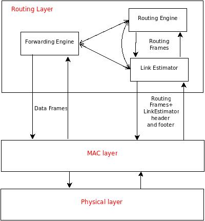

# Sensors Network Model

This simulation model is the result of a didactic project for the
<a href="http://www.dis.uniroma1.it/~hpdcs/index.php?option=com_content&view=article&id=22">
Concurrent and Parallel Programming</a> course of the Master of Science of
Engineering in Computer Science at <a href="http://cclii.dis.uniroma1.it/?q=it/msecs">Sapienza University of Rome</a>.
The author of this project is <a href="https://www.linkedin.com/in/leonidavide">Davide Leoni</a>.

<h2>Goal and Motivations</h2>

The goal of this project is to build a model to simulate the behaviour of <i>wireless sensor network (WSN)</i>: these networks consist of small devices featuring power source, a microprocessor, a wireless interface, some memory and one or more sensors. They are used to gather information from the sensors in a given location or region.
 Because of the limited radio communication range, nodes can communicate using <i>multi-hop routing protocols</i>.
 Many alghorithms and protocols have been developed to collect data inside wireless sensors networks, and among these, the <i><b>Collection Tree Protocol (CTP)</b></i> is one of the most adopted for reaseach, teaching and commercial products. It has been already deployed in many real sensors networks and it has been implemented on different hardware platforms using various programming languages, from C to Java.
 This model provides a simulation of a WNS running the CTP and is meant to be run on the <a href="https://github.com/HPDCS/ROOT-Sim">ROme OpTimistic Simulator (ROOT-Sim)</a>.

<h2>Collection Tree Protocol</h2>
<h3>Overview</h3>

As already said, CTP is a <i>data collection</i> protocol for WNSs, so, just like the other protocols of such kind, it is based on (at least) one routing tree: the nodes are the devices featuring the sensors (that continuously collect physical data) and the links are the wireless 1-hop links among them; two nodes are neighbors if an edge exists between them.
 The root of the tree collects data packets that are forwarded by the other nodes of the tree. Each node forwards packets to its <i>parent</i>, chosen among its neighbor nodes. In order to make a choice, each node must be aware of the state of its neighbors: that's why nodes continuously broadcast special packets, called <i>beacons</i>, describing their condition.
  Data collection protocols differ in two aspects:
<ol>
<li>the <i>metric</i> used by the nodes to choose their parents</li>
<li>the capability of identifying and repairing critical situations like <i>routing loops</i></li>
</ol>
The main challenge for data collection protocols is represented by the fact that wireless links between nodes are not realiable; rather they are very instable.

<h3>Architecture</h3>

CTP consists of three main logical software components:
<ol>
<li><i><b>Link Estimator</b></i></li>
<li><i><b>Routing Engine</b></i></li>
<li><i><b>Forwarding Engine</b></i></li>
</ol>

The above picture shows the software components of a node running the Collection Tree Protocol: arrows between components show that there's interaction between them.
  The metric adopted in CTP for the selection of the parent node is the <i><b>ETX (Expected Transmissions)</b></i>: a node whose ETX is equal to <i>n</i> can deliver a data packet to the root node with an average of <i>n</i> transmissions.
 The ETX of any node is recursively defined as the ETX of its parent plus the ETX of its link to the parent; the root node represents the base case in this recursion, and its ETX is obviously equal to 0.
 Packets flow in the collection tree from the nodes to the root according to the gradient represented by ETX, from the leaf nodes, having the highest value of ETX, to the root of the node, where the ETX is 0.  
The ETX associated to a link is referred to as <i>1-hop ETX</i> and is computed by the Link Estimator; the ETX associated to a neighbor is referred to as <i>multi-hop ETX</i> (or simply ETX) and is the sum of the ETX declared by the neighbor (through its beacons) and the 1-hop ETX of the link to the neighbor.

<h3>Link Estimator</h3>

This is in charge of computing the incoming and outgoing quality of the links, in order to evaluate their 1-hop ETX.
 In particular, the <i>incoming quality</i> is calculated as the number of beacons sent by a neighbor over the number of beacons received by the same neighbor.
  The <i>outgoing quality</i> is the ratio between the number of data packets forwarded to a neighbor and the number of acknowledgements sent by this.
  Analyzing the headers and footers of beacons sent and received by the node, the Link Estimator builds and updates a table, the <i>link estimator table</i>, where it stores the 1-hop ETX of each neighbor node.

<h3>Routing Engine</h3>

This component is dedicated to the selection of the <i>parent</i> node, i.e. the neighbor with the lowest value of the multi-hop ETX.
  Since the multi-hop ETX is the sum of the 1-hop ETX and the ETX declared by neighbors in their beacons, the Routing Engine has to maintain a table, called <i>routing table</i>, where it stores the last ETX value read in the beacons from each neighbor : in this way, it is able to always choose the "best" neighbor (the one with the lowest multi-hop ETX) as parent.
 On one hand, the Routing Engine continuously updates the table reading the information contained in the beacons received from the neighbors, on the other hand it writes the ETX of the current parent in the beacons to be sent to the neighbors.
 This component is tightly coupled with the Link Estimator, since it needs to know, for each neighbor, the 1-hop ETX of the corresponding link. Their respective tables are also connected. For example, if the entry corresponding to a neighbor is removed from the link estimator table (probably because it is no longer reachable), the Routing Engine is forced to remove the entry corresponding to the neighbor also from the routing table.

<h3>Forwarding Engine</h3>

By mean of the Forwarding Engine, a node performs three tasks:
<ol>
<li align="justify">Forwards data packets received by its neighbors to the node that it has selected as parent; this, on its turn, will forward the packets to its own parent, so they will be finally delivered to the root of the collection tree.</li>
<li align="justify">Detects and tries to fix <i>routing loops</i> (two or more nodes that send packets among each other forever, in such a way that the root will never receive them).</li>
<li align="justify">Detects and drops duplicate packets; this is achieved thanks to a cache where it stores the most recently sent data packets: before forwarding a packet, it checks whether there is one identical in the cache and, if so, drops the packet.</li>
<li align="justify">In case a node is congested, i.e. more than half of its output queue is full, so if more packets were sent to it it would soon start dropping them, signals this condition to the neighbours by setting a flag in the packets sent; when the Routing Engine of the neighbours notices the flag, it may choose not send beacons to the congested node or replace it with another node in case the former is the actual parent.</li>
</ol>

<h2>The Simulation Model</h2>
<h3>Overview</h3>

There are many aspects that can be taken into account when developing a model of a WNS, depending on how accurate the simulation has to be and also on the aspects the simulation is focused on. Some of them are:
<ol>
<li align="justify"><b>connectivity</b> -> given a node, only some other nodes, referred to as <i>neighbours</i>, are capable of communicating with it because of different factors, like the direction of the antennas, the presence of obstacles and the limited transmission power of the radio transceivers. Connectivity is usually modelled in the 2-dimensional space with <i>graphs</i>, whose vertices represent the nodes, with an edge between all the pairs of nodes that are neighbours, i.e. are in each other's communication range.
The simplest model is the <i>Unit Disk Graph</i>, with <i>omnidirectional antennas</i> and no obstacles: the neighbours of a node are all those nodes within a disk of unitary length.
More realistic models simulate obstacles and non-omnidirectionality of antennas including the chance that two nodes are neighbours with some probability when their distance is in the interval [<i>p</i>,1]; if the distance is less than <i>p</i> they are certainly neighbours and if it's bigger than 1 they can't communicate.Even more realistic models would assign different <i>gains</i> to each link of a node in order to simulate the <i>directionality</i> of antennas. Finally, the <i>reliability of links</i> can be simulated with <i>probabilistic links</i>: links are up or down according to some probability distribution.</li>
<li align="justify"><b>interferences</b> -> wireless links use a shared communication medium and the transmissions are affected by interferences, so a node may not correctly receive a message sent by a neighbor node because, for example, there's another transmission going on at the same time. Also, a signal sent by a node may interfere with itself because of <i>multipath propagation</i> and nodes are affected by electromagnetic noise.  Interferences are most commonly simulated using the <i>SINR (Signal-to-Intererence Plus Noise)</i> model:<b> the successful reception of a message depends on the strength of the signal received, the level of noise from the environment and the interferences caused by simultaneous transmissions; the strength of the signal received is directly proportional to the signal power and inversely proportional to the distance between the sender and the receiver, because of the <i>pathloss</i>.</b>
 The strength of the signal sent by the nodes may also be modelled: the <i>transmission power</i> may be either be constant ot it may depend on the distance between the sender and the receiver. Finally, some models do not take into account all the interferences, but only the strongest ones, due to the closest transmitting node.</li>
<li align="justify"><b>nodes' knowledge</b> -> if nodes run a <i>global algorithm</i> they are full aware of the state of all the other nodes; if the algorithm is <i>distributed</i>, nodes only know their own state when they start and they can learn about the state of their neighbours little by little by sending and receving packets.</li>
<li align="justify"><b>communication modes</b> -> a model can simulate the communication among nodes adopting a <i>broadcast model</i>, where messages are received by all nodes within the range of the wireless transceiver, or a <i>message-passing model</i>, where nodes can send packets individually to the neighbours they choose.</li>
<li align="justify"><b>medium access</b> -> the access to the transmission medium can be <i>ideal</i> (nodes can access it whenever they want to and messages are instantaneously broadcasted to all neighbours) or it may include <i>collisions</i>, that prevent two nodes from concurrently accessing the medium: if a node senses a collision, it backs off for a certain time before transmittin the packet again.</li>
<li align="justify"><b>nodes' distribution</b> -> nodes may be distributed in the plane according to some distribution (uniform, grid, Poisson...) or they may be randomly distributed.</li>
<li align="justify"><b>nodes' identifiers</b> -> usually nodes are assigned unique identifiers and they can be assigned randomly or according to some distribution, just like their coordinates.</li>
<li align="justify"><b>nodes' local information</b> -> nodes may have access to some pieces of information about the other nodes, particullarly regarding the other nodes' coordinates.</li>
<li align="justify"><b>nodes' energy consumption</b> -> the simulation of a wireless sensors network may also model the energy consumed by the nodes during the transmission of the packets. If this is the case, the node should spend some time in <i>sleeping mode</i>, a period of time during which it receives no messages, otherwise it will soon run out of energy and it will crash.</li>
<li align="justify"><b>reliability of nodes</b> -> the hardware featured by nodes is supposed to work under stated conditions for a certain period of time: after this period they are likely to fail. But nodes may also fail earlier if, for instance, they run out of energy or a some external disturbance occurs</li>
</ol>
What follows provides a description of the proposed simulation model with respect to the above aspects.

<h3>Connectivity, interferences and nodes' distribution</h3>

<b>The network topology is specified in terms of <i>gains</i> of the links between nodes: the network is represented by a <i>complete digraph</i>, so being <i>n</i> the number of nodes, the number of edges (links) is n(n-1) and each is assigned a propagation gain.</b>
 
This model adopts the <i>wireless channel model and</i> the <i>radio model</i> by ANRG, from USC University (see "Credits and references")
  As regards with the channel, the strength of the signal received from a node (<b>P_r</b>) through a channel at distance <i>d</i> is equal to (in dB):

<b>P_r=P_t-PL(d)</b>

where <b>P_t</b> is the output power of the transmitter and <b>PL(d)</b> is the <i>pathloss</i> through the link, proportional to the distance between the two nodes connected by the link; on its turn, the contribution of the pathloss depends on the <i>pathloss exponent</i> and on the <i>multipath-propagation effects</i>, which are modelled as a gaussian random variable with mean 0.
 <b>P_r is the value assigned to each link before the simulation starts, referred to as gain of the link.</b>
 A node is affected by the <b>noise floor</b>, which depends on the radio and is static, and by the <b>white gaussian noise</b>, which depends mostly on the temperature of the environment and is added to the noise floor; it represents the dynamic component of the noise and is modelled as a gaussian random variable with mean 0. Summing up the static and the dynamic components, the resulting power of the noise is <b>P_n</b>.
 Putting all together, for each link of length <i>d</i>, the <b>SINR</b> amounts to:

<b>&gamma;(b)=P_t-PL(d)-P_n=P_r-P_n</b>

<b>A signal is received by a through a channel if the current value of the SINR is beyond a certain threshold.</b>
 Both <i>P_r</i> and <i>P_n</i> (only its static component) are fixed and have to be given as input to the simulation model: <b>the gain for each link and the noise floor for each node</b>.
 <b>All the transmissions interfere one another, so they contribute to power of the noise that has to be subtracted from the link gain to evaluate the SINR.</b>
 Links are not probabilistic, so they are always up; antennas are omnidirectional.
 The distribution of the nodes in the plane does not explicitly matter, because the topology of the network depends on the gain of the links: nevertheless, the pathloss of the signal through a channel is proportional to the distance between the two nodes, so the position of the nodes implicitely contributes to the topology (see "Input to the simulation").   

<h3>Nodes' knowledge, local information and nodes' identifiers</h3>

The Collection Tree Protocol is a <b>distributed algorithm</b>: as a node starts, it is only aware of its own state and coordinates, so it sends beacons to learn about its neighbours and about the topology of the collection tree.
 Nevertheless, a node has to know whether it has been chosen as the root of the collection tree or not. In the former case, in fact, it sets to 0 the value of the ETX in the beacons it sends to its neighbours, which is crucial because the ETX of the other nodes is recursively defined.
 Nodes are assigned unique IDs: if <i>n</i> is the number of nodes,
their IDs range from 0 to <i>n-1</i>.

<h3>Communication modes</h3>

Just like in the real world, nodes <b>only send broadcast messages</b>, which can be potentially received by all the nodes in the network. Despite of this, if a nodes sends a data packet it's only interested that a specific node, namely the intendend recipient, received it: because of this, as a node received a data packet, it sends back an acknowledgement to the sender.   

<h3>Medium access</h3>

The last layer in the software stack of the nodes, the <i>MAC (Medium Access Control) layer</i> is in charge of avoid that nodes interfere one another when they have to send a message: the <b><i>CSMA (Carrier Sense Multiple Access)</i></b> protocol is adopted to achieve this goal.
 A node starts sending a message only after he has sensed that the channel is free for a certain number of consecutive times; if this number of consecutive samples is not achieved, the packet is dropped.
Everytime the node "sees" that the channel is not free, hence a collision with other nodes would take place if it started transmitting, it backs off for a random interval of time: since all the nodes waits for a different interval of time, there are high chances that a collision is avoided. <b>A channel is regarded "free" by a node if the noise from the ambient plus the strength of the signal of all the transmissions having the node as recipient is smaller than the gain of the channel.</b>

<h3>Nodes' energy consumption</h3>

The focus of this simulation model is on the data collection algorithm and on the physical layer, so nodes are assumed to have <b>infinite energy at disposal and they never enter in <i>sleep mode</i></b>.    

<h3>Reliability of nodes</h3>

Nodes are assumed to have an <b>exponential failure distribution</b>: at time <i>t</i>, the probability that a node is failed is equal to 1-e^(-<i>lambda</i>&#42;<i>t</i>), where <i>lambda</i> is the multiplicative inverse of the <i>failure rate</i> of the nodes.
 Every time a node has to perform a step, <b>the simulator evaluates the probability of failure and adds a small random bias to it: if the result is bigger than a given threshold, the node is considered to be failed.</b>
 The random bias is necessary to model the fact that nodes don't usually fail after an exact working time, because external factors may anticipate or postpone the failure.

<h2>Implementation</h2>

<h3>Nodes</h3>

Each <i>Logical Processes (LP)</i> created by ROOT-Sim represents a node in the WSN, so this is associated with an instance of a top-level data structure named <i>node_state</i> that represents the state of the logical process during the simulation.
 Its fields belong to the following categories:
<ol>
<li align="justify"><b>related to the simulation</b>: the local value of the <i>Global Virtual Time(GVT)</i>, the ID of the node, a flag describing its state (running or failed) and flag that is set to true only if the node is the root of the collection tree</li>
<li align="justify"><b>implementation of CTP</b>: the data structures corresponding to the three software components necessary to run the protocol (see "Collection Tree Protocol")</li>
<li align="justify"><b>implementation of the MAC and physical layer</b>: the fields to lowest layer of the protocol stack and the list of pending transmissions</li>
<li align="justify"><b>statistics</b>: data gathered while running the simulation, mostly related to CTP</li>
</ol>
 A node periodically performs three tasks:
<ol>
<li align="justify"><b>gathers data from its sensor(s)</b>: data are represented by integer values randomly extracted in a predefined range</li>
<li align="justify"><b>sends a packet from its output queue</b>: either forwards a packet from another node or sends a packet containing data gathered by its own sensor(s)</li>
<li align="justify"><b>broadcasts a beacon</b>: the associated message contains the description of the actual path of the node till the root of the collection tree; this kind of messages are fundamental for the protocol to work.</li>
</ol>
Also the node continuously receives packets from other nodes and processes them.
 <b>The ID assigned by the simulator to an LP is used to determine univocally the sender and the intendend recipient of the messages exchanged in the network</b>.
<h3>Messages</h3>

<b>When a node <i>x</i> sends a packet, the Logical Process <i>x</i> schedules a new event for all the other Logical Processes</b>.
 In fact, medium of the wireless communication is shared, so all the nodes in the network will here about the message but only a few of them will actually receive it: because of pathloss and interferences, the power of the signal carrying the message may not be strong enough for the node to get this (see "Connectivity, interferences and nodes' distribution"). In case of data packets, the intendend recipient of the message will reply with an acknowledgement if it receives the first message.

<h3>Termination conditions</h3>

<b>The simulation stops as soon as the the limit for the time is reached</b>: the default value is 10 seconds, but it can be decided by the user (see "Further optional parameters related to the simulation"). This is the tighter condition for the simulation to stop.
 The simulation may stop before the time limit <b>if the root has collected a minimum number of packets sent by all the nodes in the network</b>: also the minimum number of packets can be chosen by the user (see "Further optional parameters related to the simulation").
 The simulation also stops if either the root node crashes or all the nodes but the root crash.

<h2>Usage</h2>

The model is meant to be run on <a href="https://github.com/HPDCS/ROOT-Sim">ROOT-Sim</a>, so it has to be compiled using the <b>rootsim-cc</b> compiler and it's mandatory to provide the number of logical processes (recall that each corresponds to a node in the WSN); in case the simulation is to be run in parallel, also the number of cores available has to be provided in input (see "Credits and acknowledgements" for further details on ROOT-Sim).
 The model is highly parametrized, so there's a great number of optional parameters the user can provide to the simulator in order to control various aspects of the WSN: if optional parameters are not given, defaul values are used (they are the same as TinyOS and TOSSIM).
 Beside the optional parameters, there's also a mandatory one, namely the <i>input file</i>, which defines the topology of the network.
 <b>NOTE: the input file is expected to be in the same folder as this simulation model</b>.

<h3>Input file</h3>

As said, the topology of the network is represented a complete digraph and is defined in terms of gain of the links; moreover, the radio model takes into account the noise floor and the white gaussian noise affecting each node.
 The simulation requires the user to provide his/her own topology by mean of an input file.
 <b>If there are <i>n</i> nodes in the network, the model expects a file with:
<ol>
<li align="justify"><i>n</i> couples of values for the noise floor and white gaussian noise</li>
<li align="justify"><i>n</i> (<i>n-1</i>) values for the gain of the links</li>
</ol>
</b>
The syntax of a row containing the gain of a link is:

gain TAB <i>source_node_id</i> TAB <i>sink_node_id</i> TAB <i>gain_of_the_link</i>

and the one of a row containg the noise of node is:

noise TAB <i>node_id</i> TAB <i>noise_floor</i> TAB <i>noise_floor</i>

The reason for such a syntax is the following: <b>in case the user has no data from a real deployment of WSN at disposal, he/she can still run the simulation on a realistic network topology. In fact, it only takes to run the java script <i>LinkLayerModel.java</i>, featured by TOSSIM (see "Credits and acknowledgements"): this creates the input file with the syntax required by this simulation model.</b>  The script allows the user to design a network topology with plausable values for the gain of links and noise floor of the nodes. In fact, the gain of a link, according to the channel model proposed above, depends on the distance of the nodes connected by the link, because it takes the pathloss into account. Hence, as the user has chosen the topolofy of the network in terms of coordinates of the nodes, the script translates this into the gain of the links between all the pairs of nodes. The user can decide the coordinates of the nodes or it can let the script choose them according to three different distributions (grid,uniform,random).
  As regards with the noise floor, it's calculated according to the radio model proposed above.
 The user can provide the parameters for both the channel and the radio model giving the script a configuration file.
 The version of the script included in the repository is slightly modified in order to be compiled even if a TinyOS distribution is not available.
More about the usage of the script can be found <a href="https://github.com/tinyos/tinyos-main/blob/master/doc/html/tutorial/usc-topologies.html">here</a>.

<h3>Optional parameters related to the physical layer</h3>

<ol>
<li align="justify"><b>white_noise_mean</b> -> The white noise has a gaussian distribution with the mean value given by this parameter</li>
<li align="justify"><b>channel_free_threshold</b> -> If the strength of the signal perceived is below this threshold, the channel is considered free; the value of this constant is the same used for the CC2420 radio</li>
</ol>

<h3>Optional parameters related to the MAC layer</h3>

<ol>
<li align="justify"><b>csma_symbols_per_sec</b> -> Number of symbols per second (baud rate)</li>
<li align="justify"><b>csma_bits_per_symbol</b> -> Number of bits per symbol</li>
<li align="justify"><b>csma_min_free_samples</b> -> Number of times the node "sees" the channel free before it starts sending</li>
<li align="justify"><b>csma_max_free_samples</b> -> Upper bound for the number of times the node "sees" the channel free before it starts sending</li>
<li align="justify"><b>csma_high</b> -> Upper bound of the backoff range (in symbols). It is multiplied by the exponent base to the n-th power,where n is the number of times the node has already backed off => after the first backoff the upper bound of the range is CSMA_HIGH&#42;CSMA_EXPONENT_BASE, after the second one it is CSMA_HIGH&#42;CSMA_EXPONENT_BASE*CSMA_EXPONENT_BASE</li>
<li align="justify"><b>csma_low</b> -> Lower bound of the backoff range (in symbols). It is multiplied by the exponent base to the n-th power,where n is the number of times the node has already backed off => after the first backoff the lower bound of the range is CSMA_LOW&#42;CSMA_EXPONENT_BASE, after the second one it's CSMA_LOW&#42;CSMA_EXPONENT_BASE*CSMA_EXPONENT_BASE</li>
<li align="justify"><b>csma_init_high</b> -> Upper bound of the initial range for the backoff (in symbols)</li>
<li align="justify"><b>csma_init_low</b> -> Lower bound of the initial range for the backoff (in symbols)</li>
<li align="justify"><b>csma_rxtx_delay</b> -> Time needed by the radio transceiver to switch from Transmission (TX) to Reception (RX) and vice-versa, expressed in symbols (500 us ~= 32 symbols)</li>
<li align="justify"><b>csma_exponent_base</b> -> Base of the exponent used to calculate the backoff; if equal to 1, the range where the random value of the backoff time is selected is fixed</li>
<li align="justify"><b>csma_preamble_length</b> -> Number of symbols corresponding to the preamble that precedes every frame transmitted by the radio (in accordance with the IEEE 802.15.4 standard)</li>
<li align="justify"><b>csma_ack_time</b> -> In accordance with the IEEE 802.15.4 standard, an acknowledgement frame is transmitted by the receiver 12 symbol periods after the last symbol of the incoming frame. Its format includes a 6 bytes preamble and 5 bytes MAC PROTOCOL DATA UNIT (MPDU), so the size of an acknowledgment is 11 bytes = 88 bits =>  since each symbol corresponds to 4 bits, the length in symbols is 22. Adding the 12 symbols delay, the total number of symbols for the reception of an ack is 34</li>
<li align="justify"><b>csma_sensitivity</b> -> The strength of a signal has to be weaker by at most this value than the strength of the interferences for the signal to be received by the radio transceiver of a node</li>
</ol>

<h3>Optional parameters related to the link estimator layer</h3>

<ol>
<li align="justify"><b>evict_worst_etx_threshold</b> -> If a node has an 1-hop ETX bigger than this threshold, it is evicted from the estimator table in case a new entry has to added and the table itself is full</li>
<li align="justify"><b>evict_best_etx_threshold</b> -> If a node has an 1-hop ETX bigger than this threshold, it is evicted from the estimator table if a new entry has to be added and the table itself is full AND A FREE PLACE FOR THE ROOT NODE HAS TO BE FOUND</li>
<li align="justify"><b>max_pkt_gap</b> -> If the number of beacons lost from a neighbor is bigger than this value, the entry for the neighbor is reinitialized</li>
<li align="justify"><b>alpha</b> -> The link estimation is exponentially decayed with this parameter ALPHA</li>
<li align="justify"><b>dlq_pkt_window</b> -> # of packets to be sent before updating the outgoing quality of the link to a neighbor</li>
<li align="justify"><b>blq_pkt_window</b> -> # of beacons to be received before updating the ingoing quality of the link to a neighbor</li>
</ol>

<h3>Optional parameters related to the routing engine layer</h3>

<ol>
<li align="justify"><b>update_route_timer</b> -> After such interval of time, the route of the node is (re)computed (in seconds)</li>
<li align="justify"><b>max_one_hop_etx</b> -> Neighbors whose links have a 1-hop ETX bigger than or equal to this threshold can't be selected as parent</li>
<li align="justify"><b>parent_switch_threshold</b> -> If the current parent is not congested, a new parent is chosen only if the associated route has an ETX that is at least PARENT_SWITCH_THRESHOLD less than the ETX of the current route</li>
<li align="justify"><b>min_beacons_send_interval</b> -> Minimum value (max frequency) for the interval between two beacons sent (in seconds)</li>
<li align="justify"><b>max_beacons_send_interval</b> -> Maximum value (min frequency) for the interval between two beacons sent (in seconds)</li>
</ol>

<h3>Optional parameters related to the forwarding engine layer</h3>

<ol>
<li align="justify"><b>max_retries</b> -> Max number of times the forwarding engine will try to transmit a packet before giving up</li>
<li align="justify"><b>data_packet_transmission_offset</b> -> Interval of time after which the node tries to resend a data packet that has not been successfully sent or acknowledged (in seconds)</li>
<li align="justify"><b>data_packet_transmission_delta</b> -> Delta applied to calculate the random interval before a retransmission</li>
<li align="justify"><b>no_route_offset</b> -> Interval of time after which the node tries to resend a data packet in case it has not chosen a parent yet (in seconds)</li>
<li align="justify"><b>send_packet_timer</b> -> Period of the timer that triggers the sending of a new data packet (in seconds)</li>
<li align="justify"><b>create_packet_timer</b> -> Period of the timer that triggers the creation of a new data packet (in seconds)</li>
<li align="justify"><b>min_payload</b> -> Lower bound for the range of the data gathered by the node</li>
<li align="justify"><b>max_payload</b> -> Upper bound for the range of the data gathered by the node</li>
</ol>

<h3>Further optional parameters related to the simulation</h3>

<ol>
<li align="justify"><b>root</b> -> The ID of the node designed as root of the collection tree</li>
<li align="justify"><b>failure_lambda</b> -> Interval of time after which the node tries to resend a data packet that has not been successfully sent or acknowledged (in seconds)</li>
<li align="justify"><b>failure_threshold</b> -> The exponential failure distribution tells the probability that a failure occurs before a certain time => the following parameter determines which is the minimum probability for the node to be considered as failed by the simulator</li>
<li align="justify"><b>max_simulation_time</b> -> Maximum value for the simulation time: when reached, the simulation stops (in seconds)</li>
<li align="justify"><b>collected_packets_goal</b> -> Lower bound of data packets received by the root from each node for the simulation to stop</li>
</ol>

<h2>Credits and acknowledgements</h2>

The implementatio of the Collection Tree Protocol is the adaptation of the one comprised in the last release of <a href="https://github.com/tinyos">TinyOS</a> to ROOT-Sim.
Many references to CTP and to its implementation can be found <a href="http://sing.stanford.edu/gnawali/ctp/">here</a>: among these references, the one that helped me the most is by  <a href="http://ctp-castalia.googlecode.com/files/colesanti_santinis_2011_ctp-castalia.pdf">Ugo Colesanti and Silvia Santinia</a>.
 The simulation of the MAC and physical layers follows is largely taken from <a href="http://tinyos.stanford.edu/tinyos-wiki/index.php/TOSSIM">TOSSIM</a> (the simulator shipped with TinyOS) and adapted to ROOT-Sim: an explanation of the underlying channel and radio models is available <a href="http://anrg.usc.edu/downloads/LinkModellingTutorial.pdf">here</a>.

